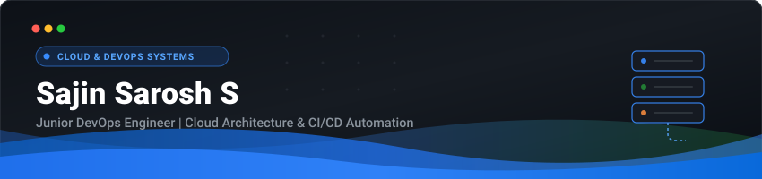

  

  

  

    
    
    
  

---

### 🚀 About Me

- 👨‍💻 **Role**: Junior DevOps Engineer focusing on cloud infrastructure, containerization, and automation.
- 🐳 **Core Competencies**: Containerizing applications with **Docker**, configuring **CI/CD pipelines with GitHub Actions**, and managing **Linux** server environments.
- ☁️ **Cloud**: Deploying and managing resources on **AWS**.
- 🐍 **Scripting & Automation**: Writing automation and tooling scripts in **Python** and **Bash**.
- 🌱 **Currently Learning**: Kubernetes orchestration, Terraform (Infrastructure as Code), and cloud monitoring.
- 📫 **Reach Me**: [saroshuki@gmail.com](mailto:saroshuki@gmail.com)

---

### 🛠️ Core Skills & Technologies

#### ☁️ Cloud & DevOps

#### 💻 Programming & Scripting

#### 🧰 Tools & Version Control

---

### 📂 Featured Projects

<table>
  <tr>
    <td width="50%" valign="top">
      <h3 align="center">🐳 <a href="https://github.com/SAJIN-SAROSH-S/Age-Calculator-Docker">Age Calculator Docker & CI/CD</a></h3>
      

        
        
        
      

      
A containerized Java application with automated CI/CD workflows built using GitHub Actions. Implements automated building, testing, and Docker image containerization on every commit.

    </td>
    <td width="50%" valign="top">
      <h3 align="center">🎬 <a href="https://github.com/SAJIN-SAROSH-S/ai-video-editor">AI Video Editor</a></h3>
      

        
        
        
      

      
An automated video assembly pipeline built with Python and FastAPI. Features background task handling, multi-tier media scraping, and multi-track rendering with FFmpeg.

    </td>
  </tr>
  <tr>
    <td colspan="2" valign="top">
      <h3 align="center">💡 <a href="https://github.com/SAJIN-SAROSH-S/creation_two">Creative Board & Task Tracker</a></h3>
      

        
        
        
      

      
A full-stack Kanban task manager with persistent storage and AI brainstorming integration via Google's Gemini SDK.

    </td>
  </tr>
</table>

---

### 📊 GitHub Activity & Stats

  
  

  

